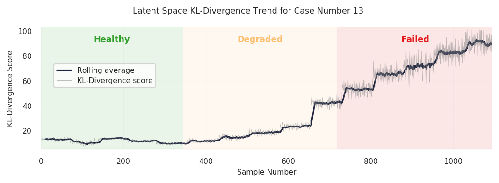

# Anomaly Detection in Metal Machining Using a Disentangled-Variational-Autoencoder
Demonstration of anomaly detection on the [UC Berkeley milling data set](https://ti.arc.nasa.gov/tech/dash/groups/pcoe/prognostic-data-repository/) using a disentangled-variational-autoencoder (beta-VAE). The method is described in my MASc thesis, *Feature Engineering and End-to-End Deep Learning in Tool Wear Monitoring*.

**milling-tool-wear-beta-vae.ipynb** is the notebook to run to replicate the results. I recommend using google colab. The notebook is optimized for it, it will run in your browser, and no package installation required! Link below.

## High-Level Summary
A disentangled-variational-autoencoder, with a temporal convolutional neural network, was used to model and trend tool wear in a self-supervised manner. Anomaly detection was used to make predictions in both the input and latent spaces. The experiment was performed on the UC Berkeley milling data set. 

The method achieved a precision-recall area-under-curve (PR-AUC) score of 0.45 across all cutting parameters in the milling data set, and a top score of 0.80 for shallow depth cuts. The study presents the first use of a disentangled-variational-autoencoder for tool wear monitoring.

The tool wear trend for case 13, generated in the latent space.

The distribution of the test data samples in the latent space. The y-axis shows the true state of the data samples (either healthy, degraded, or failed) and the x-axis shows the anomaly predictions (either normal or abnormal). The dotted line represents a decision threshold. Each small grey dot represents one data sample.

